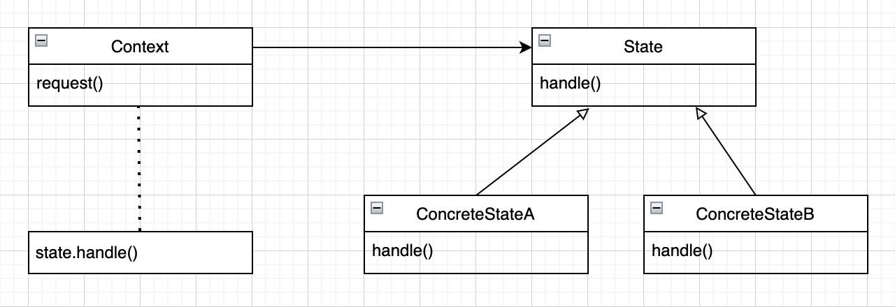
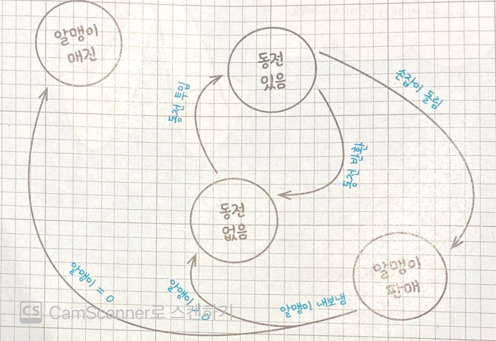

# 10.상태 패턴
## 목차
* `상태 패턴`이란?
  * 장점 및 단점
  * UML
  * 사용 방법
* `상태 패턴` vs `전략 패턴`
  * 공통점
  * 차이점
* 예제 코드
  * 클라이언트 요구 사항
  * `상태 패턴` 적용 전
  * `상태 패턴` 적용 후
---

## `상태 패턴`이란?
* 상태 패턴을 사용하면 객체의 내부 상태가 바뀜에 따라서 객체의 행동을 바꿀 수 있습니다.
* 객체의 클래스가 바뀌는 것과 같은 결과를 얻을 수 있습니다.
  
  ### 장점 및 단점
  * 장점
    * `OCP`를 준수할 수 있습니다.
      * 새로운 상태가 추가되더라도 `context` 코드가 받는 영향이 적습니다.
    * 코드 관리가 용이해집니다.
      * `context`에서 모든 상태를 관리하지 않고, 각각의 상태별로 코드가 관리되기 때문에 가독성이 향상되고 에러 발생의 소지가 줄어듭니다.
      * 불필요한 `if`문을 줄일 수 있습니다.
  * 단점
    * 클래스가 많아집니다.
      * 상태가 추가될 때 마다 클래스의 양이 증가합니다.

  ### UML
    

  ### 사용 방법
  1.`context`에는 여러 가지 내부 상태가 들어 있을 수 있습니다.   
  2.`concrete class`에서 상속 받을 `interface`를 정의 합니다.   
  3.`concrete class`는 `context`로 부터 전달 받은 요청을 처리합니다.   
  4.`context`에서 상태가 바뀔 때 마다 행동도 바뀌게 됩니다.   
  (`context`의 `request()`가 호출되면 그 작업은 상태 객체에게 맡겨집니다.)

---

## `상태 패턴` vs `전략 패턴`
* `상태 패턴`과 `전략 패턴`은 비슷한 디자인의 형태를 갖고 있습니다. 그 차이점과 공통점은 다음과 같습니다.
  ### 공통점
  * 행동을 캡슐화해서 특정 객체에게 위임합니다.
  ### 차이점
  * `상태 패턴`: 상태를 기반으로 하는 행동을 캡슐화하고 행동을 현재 상태에게 위임합니다.
    * 생성된 인스턴스의 상태 변경이 잦을 것으로 예상될 경우에 사용합니다.
  * `전략 패턴`: 바꿔 쓸 수 있는 행동을 캠슐화한 다음, 실제 행동은 다른 객체에 위임합니다.
    * 생성된 인스턴스의 상태가 거의 변경되지 않을 것으로 예상될 경우에 사용합니다.
---

## 예제 코드
* `뽑기 프로그램`을 만드는 예제 코드입니다. 
   ### 클라이언트 요구 사항
   * 다음 그림처럼 작동하는 뽑기 기계 제어용 자바 코드를 구현해주세요.
   * 추가 기능이 발생할 수 있으니 최대한 유연하고 관리하기 용이한 디자인으로 만들어주세요.
   

   ### 클라이언트 요구 분석
   * 그림만을 봤을 때 4개의 행동과 4개의 상태를 갖는 것을 알 수 있습니다.
     * `states`: `알맹이 매진`, `동전 없음`, `동전 있음`, `알맹이 판매`
     * `behaviors`: `동전 투입`, `동전 반환`, `알맹이 내보냄`, `손잡이 돌림`
   * 위 내용을 바탕으로 다음과 같은 `예제 코드`를 작성할 수 있습니다.

---

### `상태 패턴` 적용 전
  ```java
  public class GumballMachine {
   
      final static int SOLD_OUT = 0;    // 뽑기 알맹이 매진
      final static int NO_QUARTER = 1;  // 투입된 동전이 없음
      final static int HAS_QUARTER = 2; // 투입된 동전이 있음
      final static int SOLD = 3;        // 뽑기 알맹이 판매
   
      int state = SOLD_OUT; // 현재 상태
      int count = 0;    // 뽑기 기계 안의 알맹이 갯수
    
      public GumballMachine(int count) {
          this.count = count;
          if (count > 0) {
              state = NO_QUARTER;
          }
      }
    
      public void insertQuarter() {
          if (state == HAS_QUARTER) {
              System.out.println("You can't insert another quarter");
          } else if (state == NO_QUARTER) {
              state = HAS_QUARTER;
              System.out.println("You inserted a quarter");
          } else if (state == SOLD_OUT) {
              System.out.println("You can't insert a quarter, the machine is sold out");
          } else if (state == SOLD) {
              System.out.println("Please wait, we're already giving you a gumball");
          }
      }
  
      public void ejectQuarter() {
          if (state == HAS_QUARTER) {
              System.out.println("Quarter returned");
              state = NO_QUARTER;
          } else if (state == NO_QUARTER) {
              System.out.println("You haven't inserted a quarter");
          } else if (state == SOLD) {
              System.out.println("Sorry, you already turned the crank");
          } else if (state == SOLD_OUT) {
              System.out.println("You can't eject, you haven't inserted a quarter yet");
          }
      }
   
      public void turnCrank() {
          if (state == SOLD) {
              System.out.println("Turning twice doesn't get you another gumball!");
          } else if (state == NO_QUARTER) {
              System.out.println("You turned but there's no quarter");
          } else if (state == SOLD_OUT) {
              System.out.println("You turned, but there are no gumballs");
          } else if (state == HAS_QUARTER) {
              System.out.println("You turned...");
              state = SOLD;
              dispense();
          }
      }
   
      private void dispense() {
          if (state == SOLD) {
              System.out.println("A gumball comes rolling out the slot");
              count = count - 1;
              if (count == 0) {
                  System.out.println("Oops, out of gumballs!");
                  state = SOLD_OUT;
              } else {
                  state = NO_QUARTER;
              }
          } else if (state == NO_QUARTER) {
              System.out.println("You need to pay first");
          } else if (state == SOLD_OUT) {
              System.out.println("No gumball dispensed");
          } else if (state == HAS_QUARTER) {
              System.out.println("No gumball dispensed");
          }
      }
   
      public void refill(int numGumBalls) {
          this.count = numGumBalls;
          state = NO_QUARTER;
      }
  
      public String toString() {
          StringBuffer result = new StringBuffer();
          result.append("\nMighty Gumball, Inc.");
          result.append("\nJava-enabled Standing Gumball Model #2004\n");
          result.append("Inventory: " + count + " gumball");
          if (count != 1) {
              result.append("s");
          }
          result.append("\nMachine is ");
          if (state == SOLD_OUT) {
              result.append("sold out");
          } else if (state == NO_QUARTER) {
              result.append("waiting for quarter");
          } else if (state == HAS_QUARTER) {
              result.append("waiting for turn of crank");
          } else if (state == SOLD) {
              result.append("delivering a gumball");
          }
          result.append("\n");
          return result.toString();
      }
  }

  public class GumballMachineTestDrive {
  
    public static void main(String[] args) {
      GumballMachine gumballMachine = new GumballMachine(5);
  
      System.out.println(gumballMachine);
  
      gumballMachine.insertQuarter();
      gumballMachine.turnCrank();
  
      System.out.println(gumballMachine);
  
      gumballMachine.insertQuarter();
      gumballMachine.ejectQuarter();
      gumballMachine.turnCrank();
  
      System.out.println(gumballMachine);
  
      gumballMachine.insertQuarter();
      gumballMachine.turnCrank();
      gumballMachine.insertQuarter();
      gumballMachine.turnCrank();
      gumballMachine.ejectQuarter();
  
      System.out.println(gumballMachine);
  
      gumballMachine.insertQuarter();
      gumballMachine.insertQuarter();
      gumballMachine.turnCrank();
      gumballMachine.insertQuarter();
      gumballMachine.turnCrank();
      gumballMachine.insertQuarter();
      gumballMachine.turnCrank();
  
      System.out.println(gumballMachine);
    }
  }
  ```

---

### `상태 패턴` 적용 후
  ```java
  // context
  public class GumballMachine {
  
    State soldOutState;
    State noQuarterState;
    State hasQuarterState;
    State soldState;
  
    State state;
    int count = 0;
  
    public GumballMachine(int numberGumballs) {
      soldOutState = new SoldOutState(this);
      noQuarterState = new NoQuarterState(this);
      hasQuarterState = new HasQuarterState(this);
      soldState = new SoldState(this);
  
      this.count = numberGumballs;
      if (numberGumballs > 0) {
        state = noQuarterState;
      } else {
        state = soldOutState;
      }
    }
  
    public void insertQuarter() {
      state.insertQuarter();
    }
  
    public void ejectQuarter() {
      state.ejectQuarter();
    }
  
    public void turnCrank() {
      state.turnCrank();
      state.dispense();
    }
  
    void releaseBall() {
      System.out.println("A gumball comes rolling out the slot...");
      if (count > 0) {
        count = count - 1;
      }
    }
  
    int getCount() {
      return count;
    }
  
    void refill(int count) {
      this.count += count;
      System.out.println("The gumball machine was just refilled; its new count is: " + this.count);
      state.refill();
    }
  
    void setState(State state) {
      this.state = state;
    }
  
    public State getState() {
      return state;
    }
  
    public State getSoldOutState() {
      return soldOutState;
    }
  
    public State getNoQuarterState() {
      return noQuarterState;
    }
  
    public State getHasQuarterState() {
      return hasQuarterState;
    }
  
    public State getSoldState() {
      return soldState;
    }

    public String toString() {
      StringBuffer result = new StringBuffer();
      result.append("\nMighty Gumball, Inc.");
      result.append("\nJava-enabled Standing Gumball Model #2004");
      result.append("\nInventory: " + count + " gumball");
      if (count != 1) {
        result.append("s");
      }
      result.append("\n");
      result.append("Machine is " + state + "\n");
      return result.toString();
    }
  }
  ```
  ```java
  // state interface
  public interface State {
   
      public void insertQuarter();
      public void ejectQuarter();
      public void turnCrank();
      public void dispense();
      
      public void refill();
  }
  ```
  
  ```java
  // concrete class
  public class HasQuarterState implements State {
    GumballMachine gumballMachine;
  
    public HasQuarterState(GumballMachine gumballMachine) {
      this.gumballMachine = gumballMachine;
    }
  
    public void insertQuarter() {
      System.out.println("You can't insert another quarter");
    }
  
    public void ejectQuarter() {
      System.out.println("Quarter returned");
      gumballMachine.setState(gumballMachine.getNoQuarterState());
    }
  
    public void turnCrank() {
      System.out.println("You turned...");
      gumballMachine.setState(gumballMachine.getSoldState());
    }
  
    public void dispense() {
      System.out.println("No gumball dispensed");
    }
  
    public void refill() { }
  
    public String toString() {
      return "waiting for turn of crank";
    }
  }
  
  public class NoQuarterState implements State {
    GumballMachine gumballMachine;
  
    public NoQuarterState(GumballMachine gumballMachine) {
      this.gumballMachine = gumballMachine;
    }
  
    public void insertQuarter() {
      System.out.println("You inserted a quarter");
      gumballMachine.setState(gumballMachine.getHasQuarterState());
    }
  
    public void ejectQuarter() {
      System.out.println("You haven't inserted a quarter");
    }
  
    public void turnCrank() {
      System.out.println("You turned, but there's no quarter");
    }
  
    public void dispense() {
      System.out.println("You need to pay first");
    }
  
    public void refill() { }
  
    public String toString() {
      return "waiting for quarter";
    }
  }
  
  public class SoldOutState implements State {
    GumballMachine gumballMachine;
  
    public SoldOutState(GumballMachine gumballMachine) {
      this.gumballMachine = gumballMachine;
    }
  
    public void insertQuarter() {
      System.out.println("You can't insert a quarter, the machine is sold out");
    }
  
    public void ejectQuarter() {
      System.out.println("You can't eject, you haven't inserted a quarter yet");
    }
  
    public void turnCrank() {
      System.out.println("You turned, but there are no gumballs");
    }
  
    public void dispense() {
      System.out.println("No gumball dispensed");
    }
  
    public void refill() {
      gumballMachine.setState(gumballMachine.getNoQuarterState());
    }
  
    public String toString() {
      return "sold out";
    }
  }
  
  public class SoldState implements State {
  
    GumballMachine gumballMachine;
  
    public SoldState(GumballMachine gumballMachine) {
      this.gumballMachine = gumballMachine;
    }
  
    public void insertQuarter() {
      System.out.println("Please wait, we're already giving you a gumball");
    }
  
    public void ejectQuarter() {
      System.out.println("Sorry, you already turned the crank");
    }
  
    public void turnCrank() {
      System.out.println("Turning twice doesn't get you another gumball!");
    }
  
    public void dispense() {
      gumballMachine.releaseBall();
      if (gumballMachine.getCount() > 0) {
        gumballMachine.setState(gumballMachine.getNoQuarterState());
      } else {
        System.out.println("Oops, out of gumballs!");
        gumballMachine.setState(gumballMachine.getSoldOutState());
      }
    }
  
    public void refill() { }
  
    public String toString() {
      return "dispensing a gumball";
    }
  }
  ```
  ```java
  public class GumballMachineTestDrive {
  
      public static void main(String[] args) {
          GumballMachine gumballMachine = new GumballMachine(2);
  
          System.out.println(gumballMachine);
  
          gumballMachine.insertQuarter();
          gumballMachine.turnCrank();
  
          System.out.println(gumballMachine);
  
          gumballMachine.insertQuarter();
          gumballMachine.turnCrank();
          gumballMachine.insertQuarter();
          gumballMachine.turnCrank();
          
          gumballMachine.refill(5);
          gumballMachine.insertQuarter();
          gumballMachine.turnCrank();
  
          System.out.println(gumballMachine);
      }
  }
  ```
