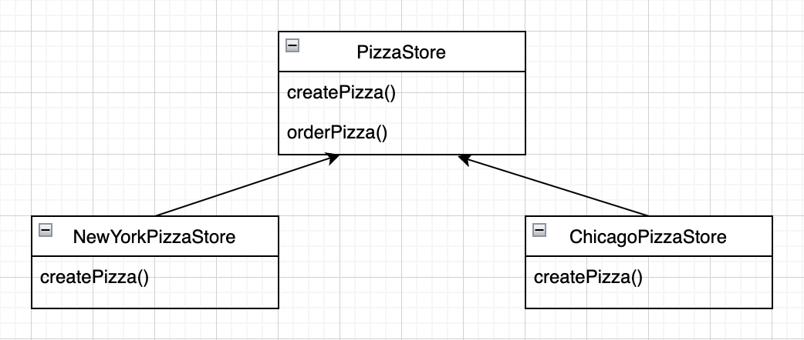
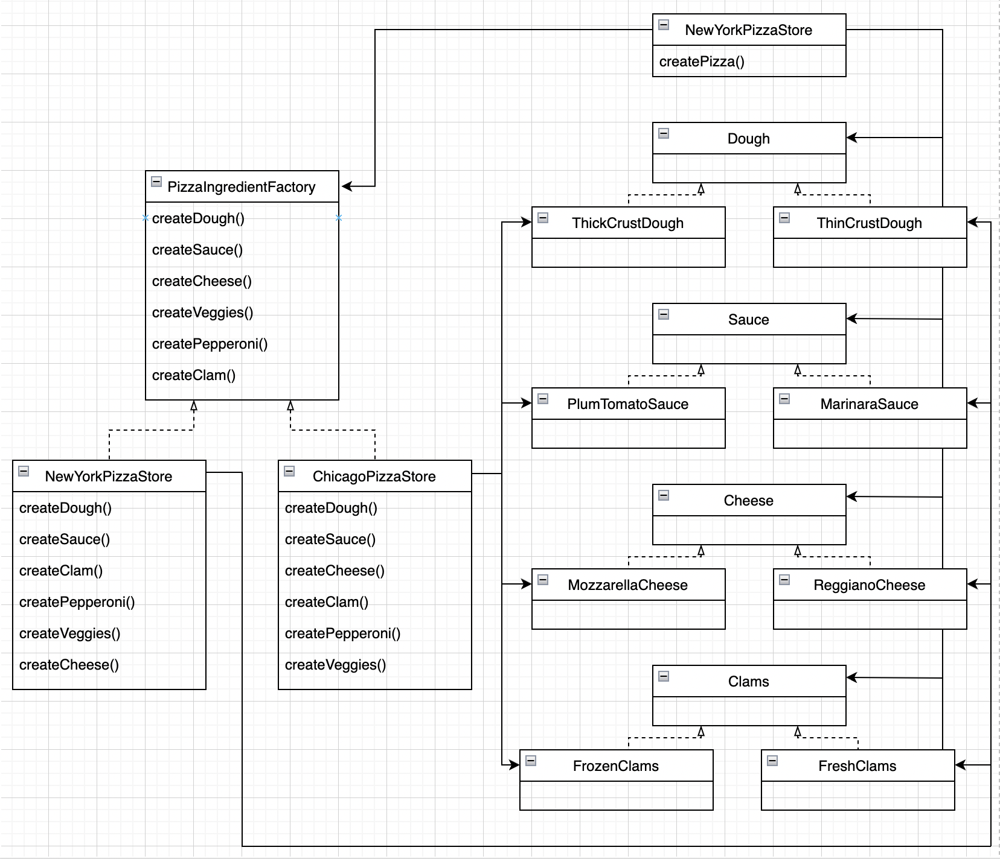

# 04.팩토리 패턴
## 목차
 * `간단한 팩토리`란?
 * `팩토리 메소드 패턴`이란?
 * `추상 팩토리 패턴`이란?
 * 요약

------

## 간단한 팩토리란?
 * `팩토리 패턴`이라고도 불리지만, 자주 사용되는 프로그래밍 기법으로 디자인 패턴은 아닙니다.
 * 객체를 생성하는 역할을 하나의 `팩토리` 객체가 맡게 하는 방법입니다.

------

* 예제 코드
   ```java
   public class SimplePizzaFactory {
       
       public Pizza createPizza(String type) {
           if (type.equals("cheese")) {
               return new CheesePizza();
           } else if (type.equals("pepperoni")) {
               return new PepperoniPizza();
           }
  
           throw new IllegalArgumentException();
       }
  
   }
   ```

------

## 팩토리 메소드 패턴이란?
 * `팩토리 메소드 패턴`에서는 객체를 생성할 때 필요한 인터페이스를 만듭니다.
 * 어떤 타입의 인스턴스를 만들지는 서브 클래스인 `concrete creator`에서 결정합니다.
 * 사용 이유
   * 생성할 객체의 타입을 예측하기 어려울 때 사용
   * 객체 생성에 대한 책임을 서브 클래스에 위임하고자 할 때 사용

------


 * 위 클래스 다이어그램을 보면 `PizzaStore` 추상 클래스를 상속 받는 `NewYorkPizzaStore` 클래스 와 `ChicagoPizzaStore` 클래스는 `createPizza()`라는 메서드를 구현하게 되어 있습니다.
 * `createPizza()`를 `orderPizza()`의 로직 안에 포함시키면서 클래스의 인스턴스 타입을 결정하는 것을 `concrete creator`에게 맡기고 있습니다.

------

 * 예제 코드
    ```java
    public abstract class PizzaStore {
        
        public Pizza orderPizza(String type) {
            
            Pizza pizza = createPizza(type);
            
            pizza.prepare();
            pizza.bake();
            pizza.cut();
            pizza.box();
            
            return pizza;
        }
        
        protected abstract Pizza createPizza(String type);
    }
     
    public class NewYorkPizzaStore extends PizzaStore {
            
        Pizza createPizza(String type) {
            if (type.equals("cheese")) {
                return new NewYorkCheesePizza();  
            }
            ...
        }
    }
    
    public class ChicagoPizzaStore extends PizzaStore {
        
        Pizza createPizza(String type) {
            if (type.equals("cheese")) {
                return new ChicagoCheesePizza();  
            }
            ...
        }
    }
    ```

------

## 추상 팩토리 패턴이란?
 * `추상 팩토리 패턴`에서는 `concrete creator`에 의존하지 않고도 서로 연관되거나 의존적인 객체로 이루어진 제품군을 생산하는 인터페이스를 제공합니다.

------


 * 위 클래스 다이어그램을 보면 `PizzaIngredientFactory` 인터페이스에는 의존적인 메서드가 없고, 피자의 재료 제품군으로 이루어져 있습니다.

------

 * 예제 코드
    ```java
    public class NewYorkPizzaStore implements PizzaIngredientFactory {
        
        public Dough createDough() {
            return new ThinCrustDough();
        }
        
        public Sauce createSauce() {
            return new MarinaraSauce();
        }
        
        ...
    }
   
    public class cheesePizza extends Pizza {
        
        PizzaIngredientFactory ingredientFactory;
   
        public CheesePizza(PizzaIngredientFactory ingredientFactory) {
            this.ingredientFactory = ingredientFactory;
        }    
   
        void prepare() {
            dough = ingredientFactory.createDough();
            sauce = ingredientFactory.createSauce();
            cheese = ingredientFactory.createCheese();
        }
    }
   
    ...
    ```
   
------

## 요약
 * `팩토리 메소드 패턴`을 사용하면 객체간의 결합도를 느슨하게 줄 수 있습니다.
 * 이를 통해, 클래스의 변경이 생겼을 때 연관된 클래스들에 영향을 적게 줄 수 있습니다.
 * 특정 클래스에 객체 생성에 대한 역할을 위임함으로써, 코드가 효율적이게 되고 코드간의 의존성을 제거할 수 있게 됩니다.
 * 장점
   * `캡슐화`를 통해 불필요한 코드를 줄이고 재사용성이 증가합니다.
   * 느슨한 결합 사용
     * `DIP`를 준수할 수 있습니다.
     * `OCP`를 준수할 수 있습니다.
 * 단점
   * 클래스가 많아지고, 클래스 계층도가 커질 수 있습니다.
