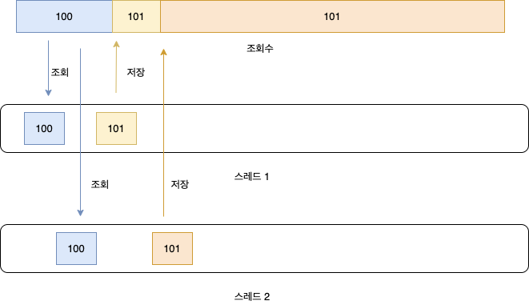

### 싱글턴 패턴이란?

---

싱글턴 패턴이란 클래스의 인스턴스를 한번만 생성하여, 이후 해당 클래스의 인스턴스가 필요할 때 이미 생성되어있는 하나의 인스턴스를 전역에서 접근하여 재사용할 수 있도록 하는 패턴이다.

### 싱글턴 패턴의 장점

---

- 매번 새로운 인스턴스를 생성한다면, 메모리 주소와 공간을 새로 할당 해야하기 때문에 메모리 낭비가 될 수 있다.
- 이미 생성된 인스턴스를 활용하기 때문에 위 과정이 생략되어 속도에 이점이 있다.
- 전역 변수는 프로그램 실행시 초기화가 되어 프로그램이 실행된 다음에야 알 수 있는 정보를 활용 할 수 없다. 싱글턴 패턴을 사용하면 초기화를 미룰 수 있어 초기화 시 다른 싱글턴 빈을 참조할 수도 있고, 다양한 초기화가 가능하다.
- 싱글턴으로 생성된 단 하나의 인스턴스는 전역적으로 접근이 가능해 데이터 공유에 유용하다.
    - 커넥션 풀, 스레드 풀 같은 자원 풀 관리, 레지스트리 설정 등 각종 상황에 유용
    - DTO와 같이 인스턴스마다 다른 값들을 가져야 하는 상황에는 맞지 않는다.

### 싱글턴 패턴의 단점

---

- 생성자가 private이기 때문에 상속을 할 수 없고, 이로 인해 다형성 또한 제공할 수 없다.
    - 즉 객체지향 설계를 적용할 수 없다는 점이 단점
- 서버환경에서 1개의 instance를 보장하지 못한다.
    - 서버에서 클래스 로더를 어떻게 구성하고 있느냐에 따라서 하나 이상의 instnace가 만들어질 수 있다.
        - 이런 경우 클래스 로더를 지정하여 하나의 인스턴스만 생성되도록 할 수 있다.
- 전역 상태를 만든다.
    - 싱글턴은 전역에서 접근할 수 있다. 또한 어디에서든 사용될 수 있기 때문에 여러 인스턴스가 자유롭게 접근하여 수정하고 데이터를 공유할 수 있는 상태가 될 수 있다. (객체지향에서는 권장되지 않는 방식)
- 사용시 구체 코드에 의존하므로 DIP(의존관계 역전 원칙)를 위반
    - `구체클래스.getInstance()` 와 같이 호출하여 구체화에 의존하는 상황

<aside>
💡 이와 같이 유연성이 떨어져 ‘안티패턴’ 이라고도 불린다.

</aside>

### 고전적인 싱글턴 패턴 (Not Thread-safe)

---

```java
public class Singleton {

    // 외부에서 변수 자체에 접근할 수 없도록 private 선언
    private static Singleton instance;

    // 외부에서 해당 클래스의 인스턴스를 만들 수 없도록 private 선언
    private Singleton() {}

    // 정적 메소드는 해당 클래스의 인스턴스가 없어도 접근이 가능
    public static Singleton getInstance() {
        // 실제 사용시 인스턴스가 생성되도록 구현 (Lazy)
        if (instance == null) {
            instance = new Singletone();
        }
        return instance;
    }

}
```

<aside>
💡 요점은 클래스 외부에서의 인스턴스 생성을 막고, 클래스 내부에서 생성한 단 하나의 인스턴스에 대해 전역 접근 지점을 제공하는 것이다.

</aside>

### 멀티스레드 환경에서의 문제점1

---

아직 인스턴스가 생성되지 않은 시점에서 다수의 스레드가 동시에 위 코드의 `getInstance()` 메소드를 호출하였을 때 다수의 인스턴스가 생성되는 문제가 발생할 수 있다.

- 현재 두개의 스레드가 동시에 해당 메소드를 호출했다고 가정해보자.
1. 인스턴스를 만들기 전 두 스레드 모두 `if (instance == null)` 을 통과하여 if문 내부로 진입
2. `Thread-A`가 인스턴스 생성 후 이 인스턴스의 주소를 전역 변수에 저장하고 이를 리턴
3. `Thread-B`가 새로운 인스턴스 생성 후 이 주소를 전역 변수에 덮어씌우고 이를 리턴
4. 두 스레드는 각각 다른 인스턴스를 리턴받아 사용하게 된다. → 이후 getInstance() 호출시 `Thread-B`가 생성한 현재 전역 변수에 저장되어있는 주소를 계속 리턴받게된다.

### 문제 해결

---

1. getInstance() 메소드에 **syncronized를 사용**하여 동시 접근 할 수 없도록 막는다.

    ```java
    public class Singleton {
    	private static Singleton uniqueInstance;
    
    	private Singleton() {}
    
    	public syncronized static Singleton getInstance() {
    		if(uniqueInstance == null) {
    			uniqueInstance = new Singleton();
    		}
    		return uniqueInstance;
    	}
    }
    ```

    - 단점
        - 속도가 많이 느려진다. (락이 걸려 해당 메소드에 하나의 스레드만 접근 가능 → 이후 접근한 스레드는 대기)
        - 처음 새로운 인스턴스를 가져올 때만 의미가 있고 이후 부터는 의미가 없어 비효율적

---

2. 위 lazy 방식과 다르게 미리 static 변수에 해당 **인스턴스를 미리 생성**하는 방법 (eager)

```java
public class Singleton {
	private static Singleton uniqueInstance = new Singleton();

	private Singleton() {}

	public static Singleton getInstance() {
		return uniqueInstance;
	}
	...
}
```

- 해당 인스턴스를 사용하지 않더라도 처음부터 해당 인스턴스를 생성하여 가지고 있다는 점이 단점

---

3. **DCL(Double-Checked Locking)** 을 사용하여 인스턴스 null 체크를 한번 더 수행해 첫번째 null 체크를 통과한 경우에만 동기화 하는 방법 → 첫번째 null 체크를 통과하지 않는다면(인스턴스가 생성된 후라면) 해당 동기화는 사용되지 않는다.

```java
public class Singleton {
	private volatile static Singleton uniqueInstance;

	private Singleton() {}

	public static Singleton getInstance() {
		if(uniqueInstance == null) {
			syncronized (Singleton.class) {
				if(uniqueInstance == null) {
					uniqueInstance = new Singleton();
				}
			}
		}
		return uniqueInstance;
	}
	...
}
```

- 처음에만 동기화 블럭이 사용되고 이후 getInstance() 호출시에는 동기화 블럭이 사용되지 않아 1번 방법에 비해 효율적
- volatile : 해당 변수에 접근할 때 CPU Cache가 아닌 Main Memory에 직접 접근하겠다 라는 것을 명시
    - 멀티스레드 환경에서 volatile이 아닌 변수는 성능상의 이유로 CPU Cache를 이용한다. CPU가 여러 개일 경우, 각 CPU 별 Cache Memory에 저장된 데이터가 달라 문제가 발생할 수 있다.
        - 다수의 스레드가 변수 A를 공유하더라도 캐싱된 시점에 따라 데이터가 다를 수도 있다. 그리고 캐싱된 데이터가 언제 메인 메모리와 동기화 되는지 정확히 알수 없다. 즉 변수 값에 접근할 때 항상 메인 메모리의 최신데이터에 접근하기위해 volatile을 사용 (모든 스레드가 동일한 값을 가지도록)
    - 가시성 문제는 해결해주지만 원자성에 대한 문제는 해결하지 못한다.

### 멀티스레드 환경에서의 문제점2

---

전역으로 같은 인스턴스를 공유하기 때문에 상태(state)를 가지면 멀티스레드 환경에서 동시성 문제가 생길 수 있다.

예를들어 `스레드 1` 에서 상태 값을 조회하고 조회 값을 변경하기 전 `스레드 2` 에서도 상태 값을 조회한다.

이 상태에서 `스레드 1` 이 상태 값을 변경하고 `스레드 2` 도 상태 값을 변경하였을 때 나중에 변경한 `스레드 2` 의 변경만 적용될 것이다.



### 문제 해결

---

이러한 문제로 인해 **싱글턴 패턴 사용시 가능한 상태를 가지지 않도록** 하는것이 좋다.

특별히 상태를 가져야한다면 동기화 해주어 상태를 각 스레드에서 동시에 접근하지 못하도록 하거나,

Atomic 클래스를 사용하여 멀티스레드 환경에서 Thread-safe을 보장해주는 방법도 있다.

- Atomic
    - synchronized 보다 적은 비용으로 동시성 보장
    - CAS(compare and swap) 알고리즘 사용
        1. 인자로 기존 값(Compared Value)과 변경할 값(Exchanged Value)을 전달
        2. 기존 값(Compared Value)이 현재 메모리가 가지고 있는 값(Destination)과 같다면 변경할 값(Exchanged Value)을 반영하며 true를 반환
        3. 반대로 기존 값(Compared Value)이 현재 메모리가 가지고 있는 값(Destination)과 다르다면 값을 반영하지 않고 false를 반환

그러나 상태를 가져 동기화를 해야 하는 상황이라면 싱글턴 패턴 사용 여부를 다시 검토해보는 것도 좋겠다.

### LazyHolder 방식 (**Bill pugh Singleton - initialization on demand holder)**

---

jvm 상에서 클래스 초기화 단계에 따른 특성을 활용한 방식이다. 많은 문서에서 권장하는 방식

- 장점
    - Thread-safe
    - Lazy initialization
    - 모든 자바 버전에서 적용 가능

```java
public class SingleTone {
	
	private SingleTone () {}
	
	private static class LazyHolder{
		private static final SingleTone instance = new SingleTone();
	}
	
	public static SingleTone getInstance() {
		return LazyHolder.instance; //클래스 로딩
	}

}
```

`getInstance()` 메서드가 호출되어 inner class인 LazyHolder의 static 변수를 참조할 때 LazyHolder 클래스를 로딩한다.

즉 `getInstance()`를 호출하기 전까지는 LazyHolder 클래스 자체가 로딩되지 않은 상태인 것이다.

이를 이용하여 Lazy하게 싱글턴을 구현할 수 있다.

### Reflection을 통해 private 생성자에 접근하는 방법

---

```java
@Test
void reflectionTest() throws Exception {
    Constructor<?> con = Singleton.class.getDeclaredConstructors()[0];
    con.setAccessible(true);
    Singleton reflectInstance = (Singleton) con.newInstance();
    
    System.out.println(reflectInstance);
    System.out.println(Singleton.getInstance());
}
// 결과: 다른 인스턴스
```

이를 해결하기 위해서는 private 생성자에 새로운 인스턴스를 만들고자 할 때 예외를 던지도록 구현해야 한다.

```java
public class Singleton implements Serializable {
    public static final Singleton INSTANCE = new Singleton();
    
    static int count = 0;
    
    private Singleton() {
    	count++;
        if(count > 1){
            throw new ...
        }
    }
   
}
```

### 직렬화와 역직렬화

---

싱글턴 클래스를 직렬화 한 후 다시 역직렬화 하는 과정에서 새로운 인스턴스가 생성 될 수 있다.

```java
@Test
void serializeTest() {
    SingletonBad singleton1 = SingletonBad.getInstance();
    // Serialize
    try {
        FileOutputStream fileOut = new FileOutputStream("out.ser");
        ObjectOutputStream out = new ObjectOutputStream(fileOut);
        out.writeObject(singleton1);
        out.close();
        fileOut.close();
    } catch (IOException e) {
        e.printStackTrace();
    }
    singleton1.setPort(443);

    // Deserialize
    SingletonBad singleton2 = null;
    try {
        FileInputStream fileIn = new FileInputStream("out.ser");
        ObjectInputStream in = new ObjectInputStream(fileIn);
        singleton2 = (SingletonBad) in.readObject();
        in.close();
        fileIn.close();
    } catch (IOException i) {
        i.printStackTrace();
    } catch (ClassNotFoundException c) {
        System.out.println("singletons.SingletonEnum class not found");
        c.printStackTrace();
    }

    System.out.println(singleton1);
    System.out.println(singleton2);
}
```

- 결과

```java
SingletonBad(protocol=https, host=naver.com, port=443)
SingletonBad(protocol=https, host=naver.com, port=80)
```

- 해결 : 클래스가 역직렬화되어 반환되기 전 교체 될 수 있도록 `readResolve()`를 구현한다.

```java
public class Singleton implements Serializable {
    public static Singleton INSTANCE = new Singleton();
    private int value;
    
    private Singleton(){};
    
    protected Object readResolve() {
        return INSTANCE; // 역직렬화 되어 반환되기 전 이 값으로 교체되어 반환됨
    }
    
    public void setValue(int value){
        this.value = value;
    }
    public int getValue(){
        return this.value;
    }
}
```

Serializable 및 Externalizable 클래스에서, readResolve 메서드는 클래스가 스트림에서 읽은 객체가 반환되전에 교체될 수 있도록 한다. readResolve 메서드를 구현함으로써 클래스는 역직렬화되는 인스턴스를 직접 제어할 수 있다.

### Enum Singleton

---

- 장점
    - Enum 인스턴스의 생성은 기본적으로 Thread-safe하여 syncronized, DCL과 같은 방법들이 필요없다.
    - 직렬화, 역직렬화 상황, 리플렉션 공격에도 인스턴스가 중복 생성되는 것을 자체적으로 막아준다.
- 단점
    - 만들려는 싱글턴이 Enum외의 클래스를 상속해야 하는 경우에는 사용할 수 없다.
    - 지연 로딩을 사용할 수 없다.

```java
@Getter
@ToString
public enum SingletonEnum {

    INSTANCE(SingletonBad.getInstance());

    private final SingletonBad singletonBad;
    private String protocol = "https";
    private String host = "naver.com";
    private int port = 80;

    SingletonEnum(SingletonBad singletonBad) {
	this.singletonBad = singletonBad;
    }

    public void test() {
	singletonBad.printInstance(protocol + "://" + host + ":" + port);
    }

    public void setPort(int port) {
        this.port = port;
    }
}
```

```java
@Test
void serializeTest() {
    SingletonEnum singleton1 = SingletonEnum.INSTANCE;
    // Serialize
    try {
        FileOutputStream fileOut = new FileOutputStream("out.ser");
        ObjectOutputStream out = new ObjectOutputStream(fileOut);
        out.writeObject(singleton1);
        out.close();
        fileOut.close();
    } catch (IOException e) {
        e.printStackTrace();
    }
    singleton1.setPort(443);

    // Deserialize
    SingletonEnum singleton2 = null;
    try {
        FileInputStream fileIn = new FileInputStream("out.ser");
        ObjectInputStream in = new ObjectInputStream(fileIn);
        singleton2 = (SingletonEnum) in.readObject();
        in.close();
        fileIn.close();
    } catch (IOException i) {
        i.printStackTrace();
    } catch (ClassNotFoundException c) {
        System.out.println("singletons.SingletonEnum class not found");
        c.printStackTrace();
    }

    System.out.println(singleton1);
    System.out.println(singleton2);
}
```

- 결과 →  enum을 사용하는 것 만으로 직렬화, 역직렬화 문제 해결

```java
SingletonEnum.INSTANCE(...@5f16132a, protocol=https, host=naver.com, port=443)
SingletonEnum.INSTANCE(...@5f16132a, protocol=https, host=naver.com, port=443)
```