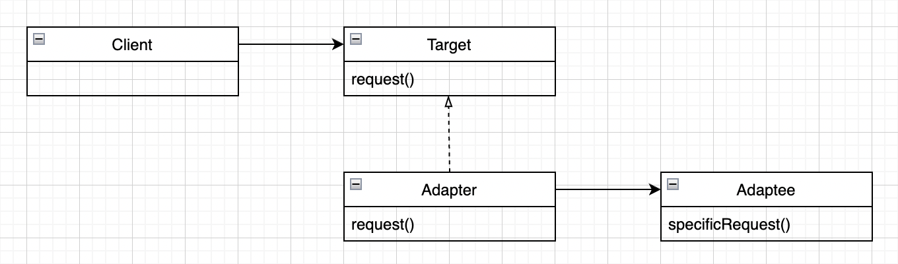
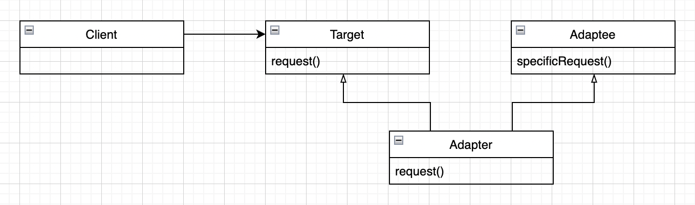

# 07.어댑터 패턴과 퍼사드 패턴
## 목차
* `어댑터 패턴`이란?
  * 사용 방법
  * 종류 및 차이점
  * 예제 코드
* `퍼사드 패턴`이란?
* 요약

------

## 어댑터 패턴이란?
* `어댑터 패턴`은 특정 클래스 인터페이스를 클라이언트에서 요구하는 인터페이스로 변환합니다.   
인터페이스가 호환되지 않아 같이 쓸 수 없었던 클래스를 사용할 수 있게 도와주는 패턴입니다.

    ### 사용 방법
    1.`Client`에서 `Target` 인터페이스로 메소드를 호출해서 `Adapter`에 요청을 보냅니다.   
    2.`Adapter`는 `Adaptee` 인터페이스로 그 요청을 `Adaptee`에 관한 (하나 이상의) 메소드 호출로 변환합니다.   
    3.`Client`는 호출 결과를 받긴 하지만 중간에 `Adapter`가 있다는 사실을 모릅니다.

    ### 종류 및 차이점   
    * 객체 어댑터
      
    * 클래스 어댑터
      
    * 차이점
      * `객체 어댑터`는 `구성`을 사용해서 클래스와 인터페이스 모두를 `Wrapping` 가능 합니다.
      * `클래스 어댑터`는 `상속`을 사용해서 클래스만 `Wrapping` 가능 합니다.   
        또한, 전략적으로 `다중 상속`을 사용해서 구현합니다.

    ### 예제 코드
    ```java
    // example for object adapter pattern
    public interface Duck {
        public void quack();
        public void fly();
    }
      
    public class MallardDuck implements Duck {
        public void quack() {
            System.out.println("꽥!");  
        }
        
        public void fly() {
            System.out.println("(멀리)파닥~ 파닥~");
        }
    }
    
    public interface Turkey {
        public void gobble();
        public void fly();
    }
    
    public class WildTurkey implements Turkey {
        public void gobble() {
            System.out.println("골골");
        }
        
        public void fly() {
            System.out.println("(짧게)파닥! 파닥!");
        }
    }
    ```
    ```java
    public class TurkeyAdapter implements Duck {
        Turkey turkey;
        
        public TurkeyAdapter(Turkey turkey) {
            this.turkey = turkey;
        }
        
        public void quack() {
            turkey.gobble();
        }
        
        public void fly() {
            for (int i = 0; i < 5; i++) {
                turkey.fly();
            }
        }
    }
    
    public class DuckTest {
        public static void main(String[] args) {
            Duck duck = new MallardDuck();
            Turkey turkey = new WildTurkey();
            Duck turkeyAdapter = new TurkeyAdapter(turkey);
    
            System.out.println("(칠면조)");
            turkey.gobble();
            turkey.fly();
    
            System.out.println("(오리)");
            duck.quack();
            duck.fly();
    
            System.out.println("(칠면조 어댑터)");
            turkeyAdapter.quack();
            turkeyAdapter.fly();
        }
    }
    ```

------


