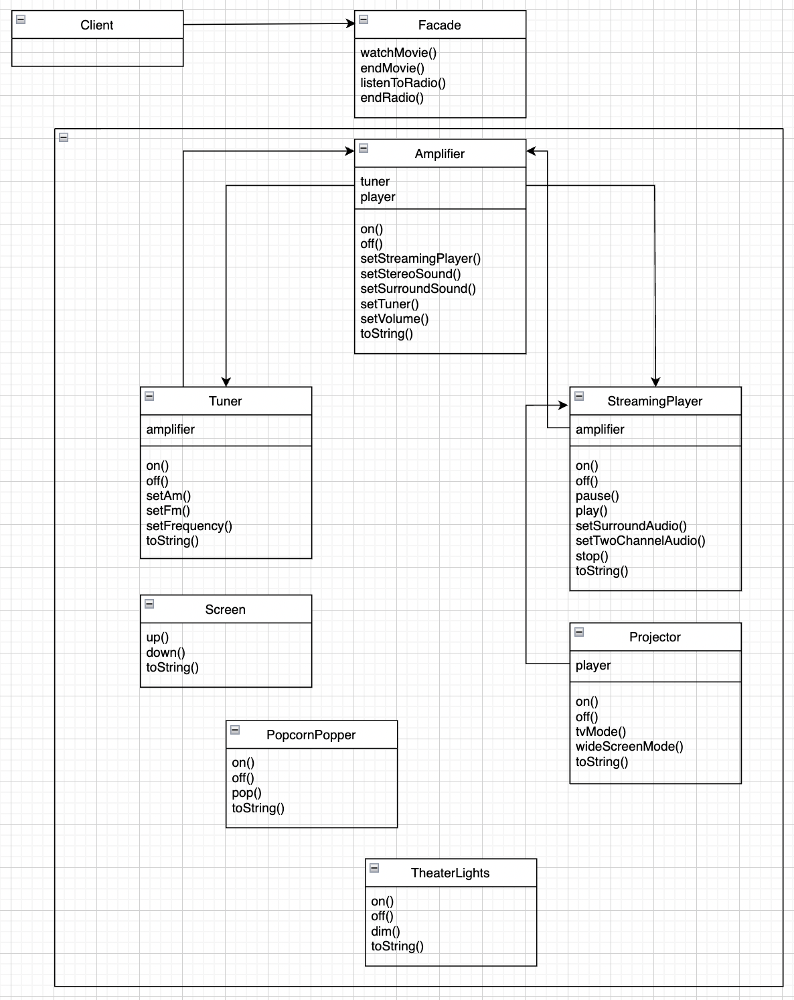

# 07.어댑터 패턴과 퍼사드 패턴
## 목차
* `어댑터 패턴`이란?
  * 사용 방법
  * 종류 및 차이점
  * 예제 코드
* `퍼사드 패턴`이란?
  * 특징 
  * 예제 코드

------

## 어댑터 패턴이란?
* `어댑터 패턴`은 특정 클래스 인터페이스를 클라이언트에서 요구하는 인터페이스로 변환합니다.   
인터페이스가 호환되지 않아 같이 쓸 수 없었던 클래스를 사용할 수 있게 도와주는 패턴입니다.

    ### 사용 방법
    1.`Client`에서 `Target` 인터페이스로 메소드를 호출해서 `Adapter`에 요청을 보냅니다.   
    2.`Adapter`는 `Adaptee` 인터페이스로 그 요청을 `Adaptee`에 관한 (하나 이상의) 메소드 호출로 변환합니다.   
    3.`Client`는 호출 결과를 받긴 하지만 중간에 `Adapter`가 있다는 사실을 모릅니다.

    ### 종류 및 차이점   
    * 객체 어댑터
      
    * 클래스 어댑터
      
    * 차이점
      * `객체 어댑터`는 `구성`을 사용해서 클래스와 인터페이스 모두를 `Wrapping` 가능 합니다.
      * `클래스 어댑터`는 `상속`을 사용해서 클래스만 `Wrapping` 가능 합니다.   
        또한, 전략적으로 `다중 상속`을 사용해서 구현합니다.

    ### 예제 코드
    ```java
    // example for object adapter pattern
    public interface Duck {
        public void quack();
        public void fly();
    }
      
    public class MallardDuck implements Duck {
        public void quack() {
            System.out.println("꽥!");  
        }
        
        public void fly() {
            System.out.println("(멀리)파닥~ 파닥~");
        }
    }
    
    public interface Turkey {
        public void gobble();
        public void fly();
    }
    
    public class WildTurkey implements Turkey {
        public void gobble() {
            System.out.println("골골");
        }
        
        public void fly() {
            System.out.println("(짧게)파닥! 파닥!");
        }
    }
    ```
    ```java
    public class TurkeyAdapter implements Duck {
        Turkey turkey;
        
        public TurkeyAdapter(Turkey turkey) {
            this.turkey = turkey;
        }
        
        public void quack() {
            turkey.gobble();
        }
        
        public void fly() {
            for (int i = 0; i < 5; i++) {
                turkey.fly();
            }
        }
    }
    
    public class DuckTest {
        public static void main(String[] args) {
            Duck duck = new MallardDuck();
            Turkey turkey = new WildTurkey();
            Duck turkeyAdapter = new TurkeyAdapter(turkey);
    
            System.out.println("(칠면조)");
            turkey.gobble();
            turkey.fly();
    
            System.out.println("(오리)");
            duck.quack();
            duck.fly();
    
            System.out.println("(칠면조 어댑터)");
            turkeyAdapter.quack();
            turkeyAdapter.fly();
        }
    }
    ```

------

## 퍼사드 패턴이란?
* `퍼사드 패턴`은 서브 시스템에 있는 일련의 인터페이스를 통합 인터페이스로 묶어줍니다.   
또한 고수준 인터페이스도 정의하므로 서브시스템을 더 편리하게 사용할 수 있습니다.
* 퍼사드 클래스를 구현해서 복잡한 시스템을 통합하여 단순하게 사용할 수 있게 만들어 줍니다.

    ### 특징   
    * 서브 시스템 클래스를 캡슐화하지 않습니다.
      * 퍼사드 패턴은 서브 시스템을 단순화한 인터페이스만을 제공하기 때문에 서브 시스템에 직접 접근이 가능합니다.
    * 코드 변경이 용이합니다.
      * 요구 기능이 변경될 경우 클라이언트 코드를 변경하지 않고 퍼사드 클래스만 수정해주면 됩니다.
 
    ### 예제 코드
    
    ```java
    public class HomeTheaterFacade {
        Amplifier amp;
        Tuner tuner;
        StreamingPlayer player;
        Projecter projecter;
        TheaterLights lights;
        Screen screen;
        PopcornPopper popper;
        
        public HomeTheaterFacade(
                Amplifier amp,
                Tuner tuner,
                StreamingPlayer player,
                Projecter projecter,
                TheaterLights lights,
                Screen screen,
                PopcornPopper popper) {
            this.amp = amp;
            this.tuner = tuner;
            this.player = player;
            this.projecter = projecter;
            this.lights = lights;
            this.screen = screen;
            this.popper = popper;
        }
        
        public void watchMovie(String movie) {
            System.out.println("영화 볼 준비중");
            popper.on();
            popper.pop();
            lights.dim(10);
            screen.down();
            projecter.on();
            projecter.wideScreenMode();
            amp.on();
            amp.setStreamingPlayer(player);
            amp.setSurroundSound();
            amp.setVolume(5);
            player.on();
            player.play(movie);
        }
        
        public void endMovie() {
            ...
        }
    }
    ```
    ```java
    public class HomeTheaterTest {
        public static void main(String[] args) {
            // 구성 요소 초기화
            HomeTheaterFacade homeTheater = new HomeTheaterFacade(amp, tuner, player, projector, screen, lights, popper);
            homeTheater.watchMovie("아바타2");
            homeTheater.endMovie();
        }
    }
    ```
